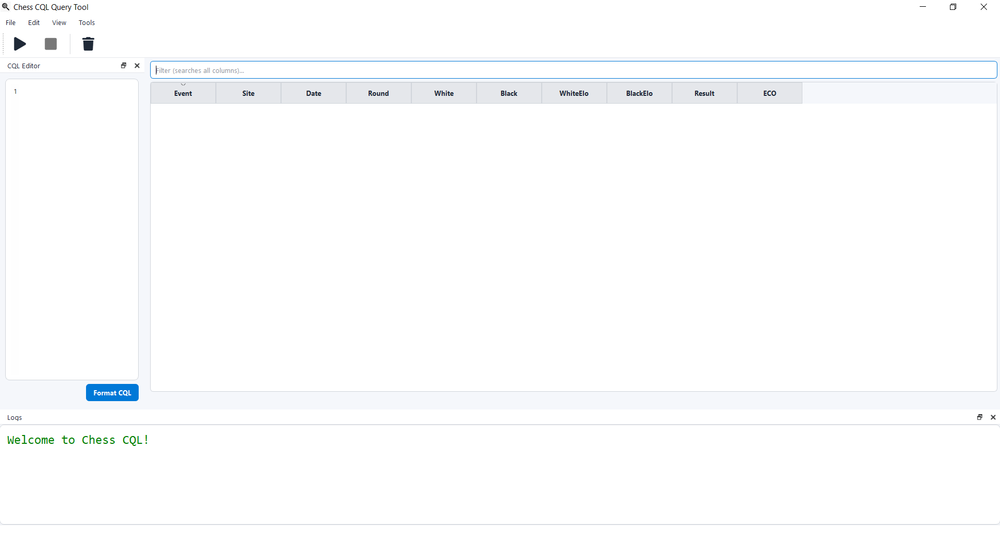

# CQL GUI (Chess Query Language Frontend)

A PyQt5 desktop application for running **Chess Query Language (CQL)** searches on PGN files with an integrated editor, result viewer, and chessboard explorer.



## ✨ Features

- **Built-in CQL Editor**  
  Syntax highlighting for `.cql` queries with Vim-style rules (keywords, functions, comments, etc.).

- **Execute Queries with Progress Tracking**  
  Run CQL queries directly from the GUI. A progress dialog shows execution status.

- **PGN Results Table**  
  Results are displayed in a sortable, searchable table. Each row corresponds to a game matching the query.

- **Interactive Chessboard Explorer**  
  Double-click a result to open the game in a chessboard viewer:
  - Navigate through moves
  - Edit PGNs
  - Analyze variations
  - Explore lines interactively

- **Integrated Tools**  
  - PGN browser
  - Export to HTML
  - Move manager
  - Data handling modules


## 🚀 Getting Started

### Requirements
- Python 3.9+
- PyQt5
- chess
- CQL executable (installed separately, [see docs](https://www.gadycosteff.com/cql/))

### Installation

```bash
git clone https://github.com/yourusername/qcql.git
cd qcql
pip install -r requirements.txt
